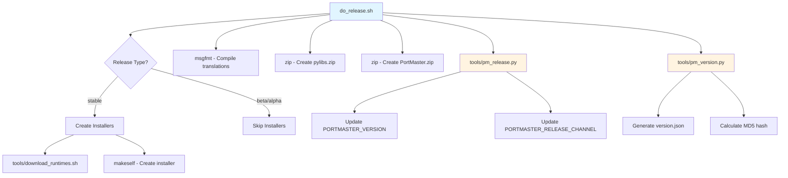
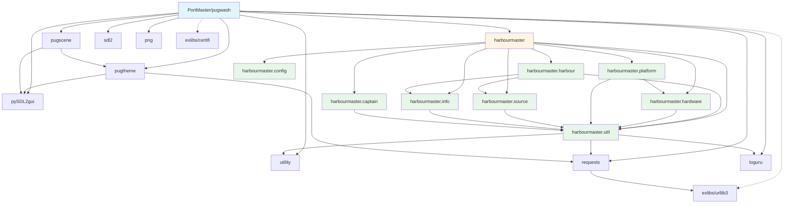
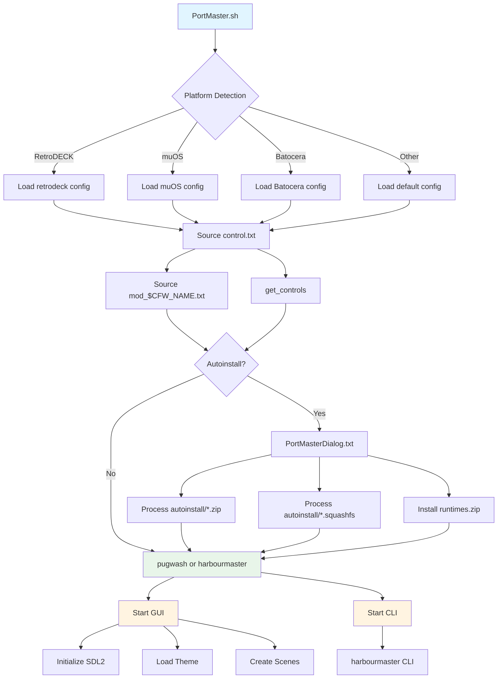
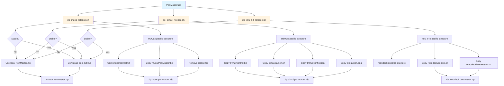
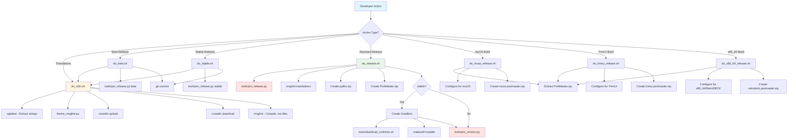
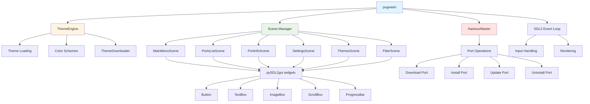

# PortMaster GUI - Dependency Diagrams

This document provides visual diagrams of the dependencies and execution flows in the PortMaster GUI repository.

## Table of Contents

1. [Build and Release Flow](#build-and-release-flow)
2. [Python Module Dependencies](#python-module-dependencies)
3. [Runtime Execution Flow](#runtime-execution-flow)
4. [Platform-Specific Builds](#platform-specific-builds)
5. [Script Interactions](#script-interactions)

---

## Build and Release Flow

This diagram shows the main build and release process, including how different scripts call each other.

## Python Module Dependencies

This diagram shows how the main Python components depend on each other.

## Runtime Execution Flow

This diagram shows the main execution paths when PortMaster runs on a device.

## Platform-Specific Builds

This diagram shows how platform-specific builds are created from the base PortMaster.zip.

## Script Interactions

This diagram shows the interactions between various build and utility scripts.

## Harbourmaster Module Architecture

This diagram shows the internal structure of the harbourmaster library.

```mermaid
graph TD
    A[harbourmaster/__init__.py] --> B[harbour.py - HarbourMaster class]
    A --> C[hardware.py - Device detection]
    A --> D[platform.py - Platform abstraction]
    A --> E[source.py - Port sources]
    A --> F[util.py - Utilities]
    A --> G[config.py - Configuration]
    A --> H[info.py - Port information]
    A --> I[captain.py - Port management]
    
    B --> J[Port Installation]
    B --> K[Port Uninstallation]
    B --> L[Source Management]
    B --> M[Runtime Management]
    
    C --> N[Device Info Detection]
    C --> O[Hardware Profiles]
    
    D --> P[Platform Detection]
    D --> Q[Platform Hooks]
    D --> R[CFW Detection]
    
    E --> S[Source Loading]
    E --> T[Port Listing]
    E --> U[Source Updates]
    
    F --> V[File Operations]
    F --> W[Download/Fetch]
    F --> X[Hash Verification]
    F --> Y[Callbacks]
    
    G --> Z[Default Paths]
    G --> AA[Configuration Constants]
    
    H --> AB[Port Metadata]
    H --> AC[Port JSON Parsing]
    H --> AD[Port Validation]
    
    I --> AE[Port Scripts]
    I --> AF[Port Execution]
    
    style A fill:#e1f5ff
    style B fill:#fff4e1
    style F fill:#e8f5e9
```

## GUI Architecture

This diagram shows how the GUI components interact.

## File Dependencies

This diagram shows key file dependencies in the repository.

```mermaid
graph TD
    A[PortMaster/] --> B[pugwash - Main GUI]
    A --> C[harbourmaster - CLI tool]
    A --> D[PortMaster.sh - Launcher]
    A --> E[pylibs/]
    A --> F[exlibs/]
    
    E --> G[harbourmaster/]
    E --> H[pugtheme.py]
    E --> I[pugscene.py]
    E --> J[pySDL2gui.py]
    E --> K[utility.py]
    E --> L[locales/]
    E --> M[resources/]
    
    F --> N[urllib3/]
    F --> O[certifi/]
    F --> P[Other bundled libs]
    
    D --> Q[control.txt]
    D --> R[mod_*.txt files]
    D --> S[PortMasterDialog.txt]
    D --> T[funcs.txt]
    
    A --> U[Platform dirs]
    U --> V[muos/]
    U --> W[trimui/]
    U --> X[batocera/]
    U --> Y[knulli/]
    U --> Z[retrodeck/]
    U --> AA[miyoo/]
    
    V --> AB[control.txt]
    V --> AC[PortMaster.txt]
    V --> AD[shGenerator.py]
    
    W --> AB
    W --> AC
    W --> AE[config.json]
    W --> AF[icon.png]
    
    X --> AD
    Y --> AD
    
    Z --> AB
    Z --> AC
    
    style A fill:#e1f5ff
    style E fill:#fff4e1
    style G fill:#e8f5e9
```

---

## Notes

### Build Scripts
- **do_release.sh**: Main release script that creates PortMaster.zip and optionally installers
- **do_i18n.sh**: Handles internationalization - extracts, uploads, downloads, and compiles translations
- **do_beta.sh** / **do_stable.sh**: Simplified scripts that call do_i18n.sh and set release channel
- **do_muos_release.sh** / **do_trimui_release.sh** / **do_x86_64_release.sh**: Create platform-specific builds

### Python Tools
- **tools/pm_release.py**: Updates version numbers and release channel in pugwash
- **tools/pm_version.py**: Generates version.json with MD5 hashes for release
- **tools/installer.sh**: Installation script packaged with makeself installers
- **theme_msgfmt.py**: Extracts translatable strings from themes

### Core Components
- **PortMaster/pugwash**: Main GUI application written in Python with SDL2
- **PortMaster/harbourmaster**: CLI tool for port management
- **PortMaster/PortMaster.sh**: Shell script launcher that detects platform and starts the appropriate tool

### Libraries
- **pylibs/harbourmaster/**: Core library for port management (shared by GUI and CLI)
- **pylibs/pySDL2gui.py**: Custom GUI framework built on PySDL2
- **pylibs/pugtheme.py**: Theme engine supporting multiple color schemes
- **pylibs/pugscene.py**: Scene management for different GUI screens
- **exlibs/**: Bundled third-party libraries (urllib3, certifi, etc.)

### Platform Support
The repository supports multiple platforms through platform-specific configuration:
- muOS
- TrimUI
- Batocera
- Knulli
- RetroDECK
- Miyoo
- Generic Linux devices

Each platform has its own configuration files in `PortMaster/<platform>/` directories.
